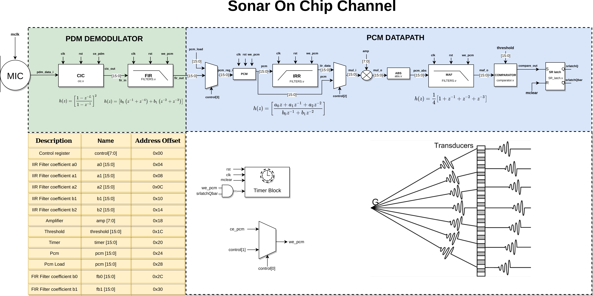
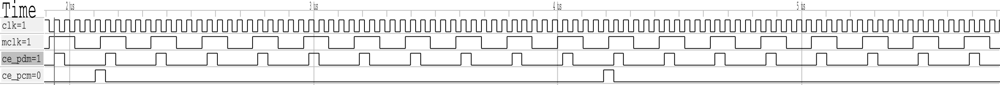
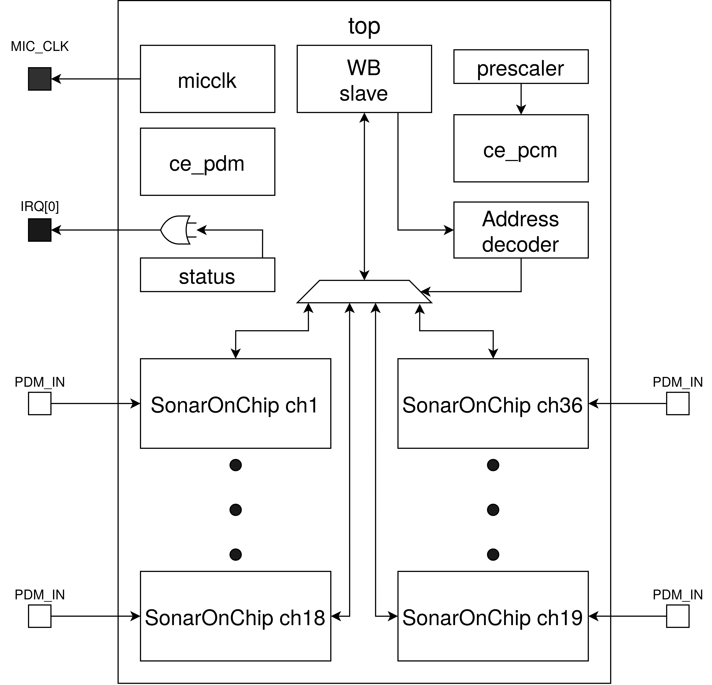
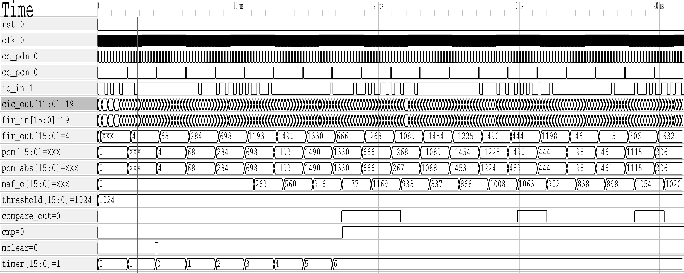
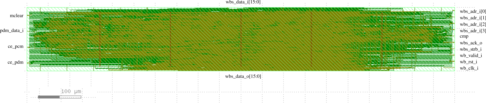
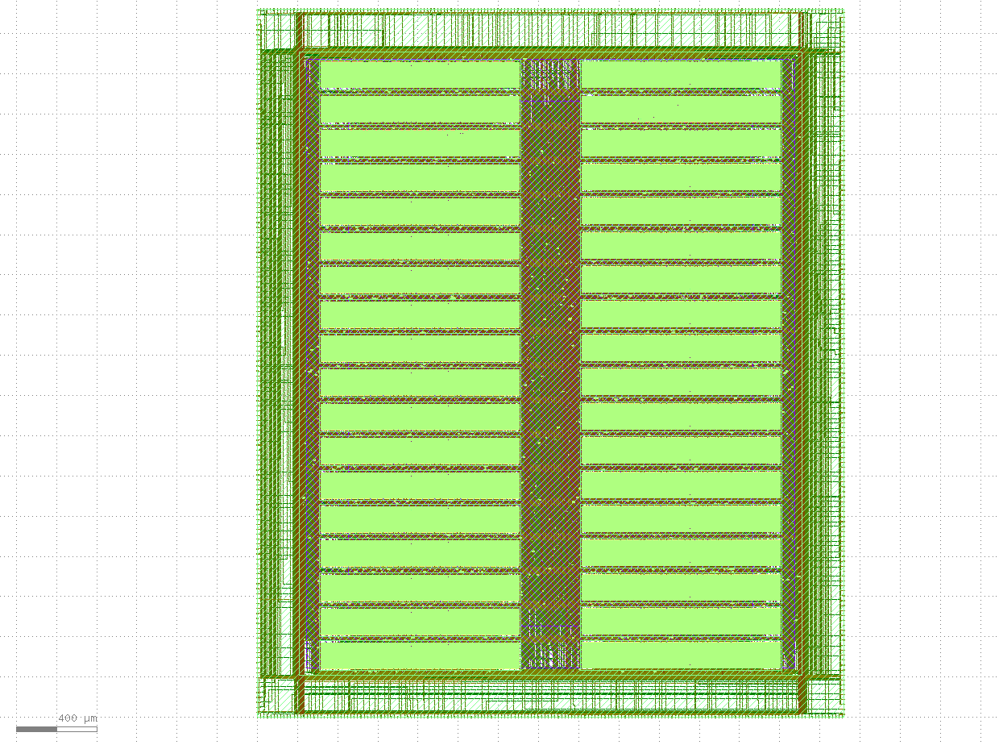
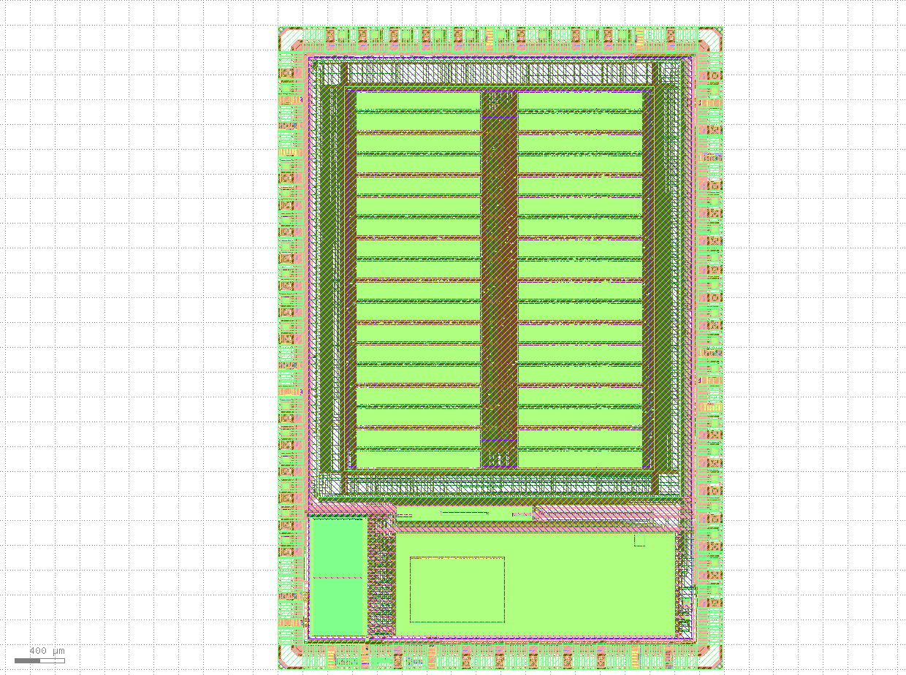

# SSCS-Sonar On Chip
## General information
The project implements a digital system for signal processing to capture and process acoustics signals from 36 MEMS microphones with an extended frequency range up to 85 kHz (low ultrasonic band). The system itself is a part of the Caravel harness and can be configured and managed from the Caravel using Wishbone bus.\
 The principle of operation of the system is the following:\
 Each, pulse density modulated (PDM), the microphone signal is processed individually using a separate channel, which demodulates PDM data recovering PCM (Pulse Code Modulation) samples, filters out audible frequencies, detects the envelope, and compare its value to a configurable threshold. The result of the comparison triggers an interrupt and stops a free-running timer configured in a capture mode. The timers are cleared synchronously on all channels and the value of each timer can be read by the RISC-V processor. The captured values of the 36 timers can be post-processed on the RISC-V processor and the direction of arrival of the wavefront can be estimated.

## Datapath description
Each channel consists of PDM demodulator, which processes the incoming signal and transforms it to PCM samples stored in **pcm** register, PCM processing block and a free running timer configured in an input capture mode. The PCM samples are filtered by a high pass filter to remove audible frequencies amplified (by a factor of 2^k), rectified, and smoothed by a 4-th order moving average MA filter. The output of the MA filter is compared with a settable threshold delivering the result of the comparison to an "S" input of a R-S latch. The output of the latch controls WE signal of a free-running, 16 bit timer, which follows the pace of PCM samples. The timer can be cleared by a global **mclear** signal connected to all channels and itt can be stopped by the RS Latch output. This configuration permits to recovery of a wavefront of incoming acoustics wave, generated by a source (G) and sampled by multiple microphones (transducers) as shown in the figure below. Once all channels detect signals above a threshold, the timers will be stopped and can be read by the host using Wishbone interface.   

The datapath has some configuration options based on control register:
* control[0] bit if set to logic 1 it permits to use control[1] bit as a WE signal for the PCM datapath, if set to 0 (default) WE is generated automatically.
* control[2] bit if set to logic 1 it bypasses the IIR filter, default value is 0,
* control[3] bit if set to logic 1 permits to load the PCM datapath with a value stored in pcm_load register (default 0),

### PDM demodulation 
The module PDM demodulator was based on a solution presentet in the confernece article [1]. We have implemented 2 stages of Recurssive Running Sum, which is characterized by 12 bit output, what should cover the dynamic range of 72 dB. It should be sufficient due to the fact, that the MEMS microphones have the dynamics range of 62 dB (A-weighted). The block diagram of the demodulator is shown below.

In order to verify the module we have performed some high level simulations in python and then we have made some evaluations based on the  following scheme.

The test signal is upsampled to the frequency of PDM modulation (4.8 MHz in our case) and then modulated in software. The generated bit stream is dumped to a file, which is used in a custom testbench. The above simulates a behavior of a MEMS microphone capturing an acoustic signal.
In the testbench the bitstream is processed by the demodulator and the results are stored in csv filtes. The results are presented graphically on the following figures.

### DSP 
In order to reduce the footprint of the channel the filters were implemented using only one adder and one multiplier. It is allowed due to the fact that the PCM frequency is much more lower (50 times) than the clock frequency of the whole system. The FIR, IIR and Moving Average (MA) filters are calculated in a subsequent sycles sharing same multiplier and adder. It was implemented using a FSM in the file src/FILTERS.v

## Top level module
The top level module consists of 36 channels, status register, prescaler register, three clock diviers, which generate :
* a 4.8 MHz clock signal **mclk** for the external microphones (50 % duty cycle),
* a 4.8 MHz clock enable signal **ce_pdm** for PDM demodulator,
* a 480 kHz (configurable) clock enable signal **ce_pcm** for the PCM datapath. 

The top level implements a Wishbone follower, which multiplexes all channels using reduced data interface (16 bits) and address bus (4 bits). 
The multipexation scheme is based on address decoding and selection of a current module using One-Hot valid signal. 
The status  register together with the most significant byte of the prescaler register hold the values of the comparison of all 36 channels. Those values are OR-ed  and passed to the IRQ[0] signal indicating detection of the signal of any microphone. The IRQ[1] and IRQ[2] are routed to the compare output of the most extreeme channels, what will permit not only detect the signal but also to determine the direction of arrival in a case of a linear array. The prescaler register set up the WE signal frequency for the PCM datapath, thus, various decimation values can be used in the datapath. The default value is 49, what corresponds to the decimation factor of 10. 

## Register map
Memory map of the system starts at address 0x3000 0000 (Wishbone Follower address space):
Register     | Value
------------ | -------------
Status               | 0x3000 0000
Prescaler            | 0x3000 0004

Each channel has 13 registers. The register mapping of the first channel is shown below:

Register     | Value
------------ | -------------
Control register  | 0x3000 0008
IIR  a0 coeff     | 0x3000 000C
IIR  a1 coeff     | 0x3000 0010
IIR  a2 coeff     | 0x3000 0014
IIR  b1 coeff     | 0x3000 0018
IIR  b2 coeff     | 0x3000 001C
Amplification     | 0x3000 0020
Threshold         | 0x3000 0024
Timer             | 0x3000 0028
PCM sample        | 0x3000 002C
PCM Load          | 0x3000 0030
FIR  b0 coeff     | 0x3000 0034
FIR  b1 coeff     | 0x3000 0038

All channels have the same register map starting from control register. The control register address of a n-th channel  can be calculated as follows: 

## Behavioral simulation of the datapath
We have tested our RTL code at the level of a single channel and also at the level of the whole Caravel chip executing custom firmware. 
The RTL level simulation of the datapath feeded with a PDM bitstream is shown in the figure below.

The io_in input provides the PDM data, which are demodulated and decimated in the datapath. the value of the timer is pushed to 0 when mclear occures and the timer is stopped, when the value of the MAF filter output maf_o is crossing the threshold. liit for a first time. 

We have found conveniet to present the result in a form of short video. 

## Preliminary layouts
One channel macro with the IO pin configuration, size 1000x150 um. In order to reduce footprint and facilitate routing we have reduced the WB bus to 16 bit for data and only 4 bits for address (each channel has 13 regsiters). We propagate also wb_valid_i and wb_strb_i derived on the top level module. The orientation of the pins should proviledge routing of the WB bus and external IO, which in our case point out towards the physical IO of the Caravel Harness. The macro of one channel consumes 4725 logic cells where 783 are flip-flops. 

User project wrapper macro with 36 channels instantiated. The channel macros in the right column are rotated 180 degrees, what facilitates WB bus routing in the center of the chip.  The top level module consmes 2046 where 783 are flip-flops. 

User project wrapper macro onboard the Caravel harness.

## Pending Issues

* Static Timing Analysis - Hold violations, multicycle paths
* Antenna violations.
* Functional simulation at the gate level in hierarchical design. We hace made some GL simulations an it works correctly however since
  we do not have the final netlist, due to the STA issues, we can not confirm that the design works at this level.   
* Reorientation of IO position on the top level and user_project_wrapper level (need to be discussed with efabless). 
 
 
## References 

[1] Sánchez-Hevia, H. A., Gil-Pita, R., & Rosa-Zurera, M. (2014, June). FPGA-based real-time acoustic camera using pdm mems microphones with a custom demodulation filter. In 2014 IEEE 8th Sensor Array and Multichannel Signal Processing Workshop (SAM) (pp. 181-184). IEEE.

## Repo description

config.tcl - main script for the OpenLane flow\
macro\ - holds two folders, which configure the macro hardening at the: (1) top level, (2) user_project_wrapper level \
src\ - holds files for  one channel of the SonarOnChip\
rtl\ - holds verilog files for functional simulation at the level of the whole Caravel Harness\
scripts\ - custom scripts for yosys and OpenSTA\
results\ - results generated by custom scripts\
sim\ - holds simulation testbench used together with rtl\ folder
This repository should be placed in the design/ folder of the OpenLane. \
You should export the following variables in your .profile\
export CARAVEL_DIR="path_to_your_caravel/caravel"\
export RV32_GCC="/path_to/riscv32/bin"\
export PDK_ROOT="/path_to_PDK/pdks"

## Authors
All the authors are with Department of Electrical and Electronics Engineering, University of the Bio Bii, Concepcion, Chile

Mauricio Montanares (undergraduate student) - group leader responsable for: high level Python scripting, RTL code development, verification, documentation.\
Maximiliano Cerda (undergraduate student) - responsable for: high level Matlab analysis, RLT code development, documentation.\
Luis Osses (undergraduate student)  - responsable for: high level Matlab analysis, RLT code development, documentation.\
Krzysztof Herman (DSc, academic teacher/researcher)- responsable for: RTL code development, verification, physical design, documentation.
